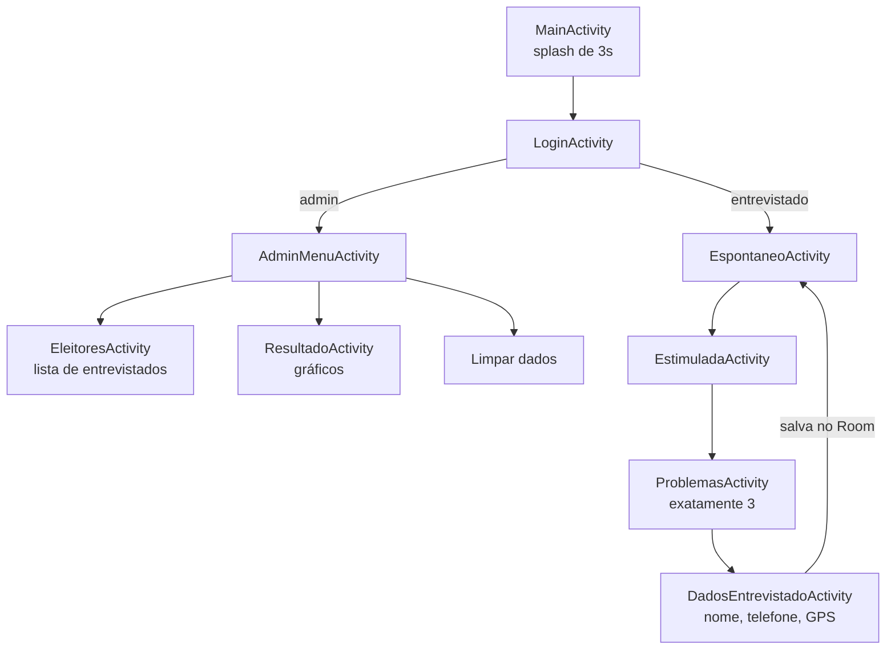
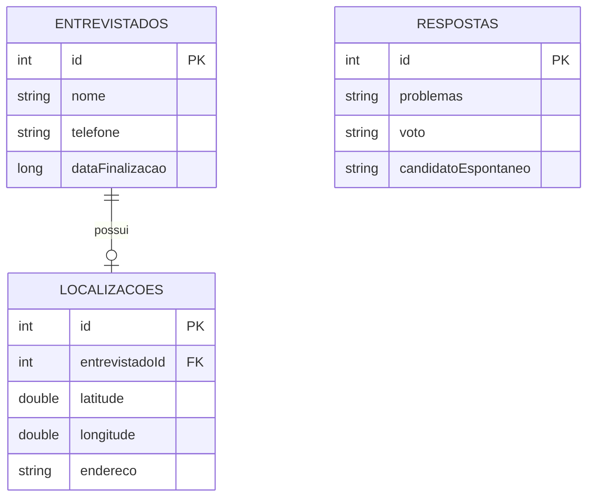
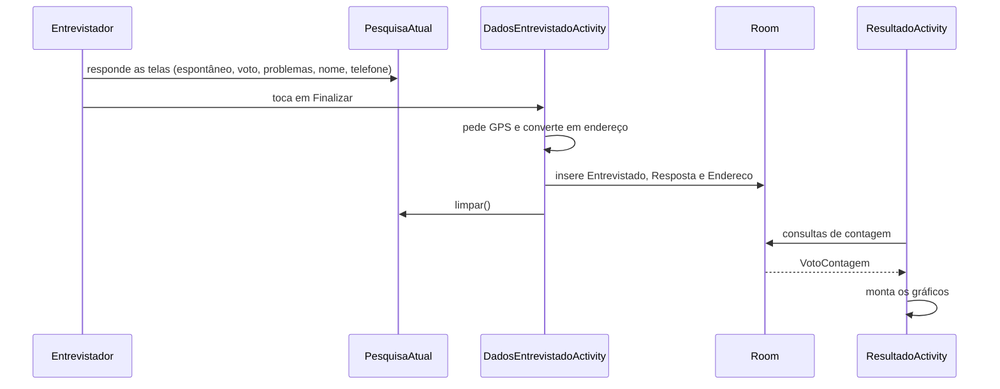

<div align="center">

# 🗳️ Eleição Pokémon — Geração I

**Aplicativo Android de pesquisa eleitoral com temática Pokémon**


</div>

---

## 📑 Sumário

- [Sobre o projeto](#-sobre-o-projeto)
- [Funcionalidades](#-funcionalidades)
- [Requisitos funcionais atendidos](#-requisitos-funcionais-atendidos)
- [Fluxo do aplicativo](#-fluxo-do-aplicativo)
- [Acessos de teste](#-acessos-de-teste)
- [Tecnologias](#-tecnologias)
- [Estrutura do projeto](#-estrutura-do-projeto)
- [Telas (Activities)](#-telas-activities)
- [Camada de dados (Room)](#-camada-de-dados-room)
- [Layouts XML](#-layouts-xml)
- [Como executar](#-como-executar)
- [Limitações conhecidas](#-limitações-conhecidas)

---

## 🎯 Sobre o projeto

Aplicativo Android desenvolvido em **Kotlin** que simula uma pesquisa eleitoral com candidatos da **Geração I de Pokémon**. Ele coleta os dados do entrevistado, registra a intenção de voto (espontânea e estimulada), os problemas considerados prioritários e a **localização geográfica** de onde a entrevista foi concluída. Ao final, apresenta os resultados em **gráficos**.

O projeto foi construído com fins didáticos: **5 candidatos** e **10 problemas** disponíveis para escolha.

## ✨ Funcionalidades

| Perfil | O que faz |
|---|---|
| 🧑‍💼 **Entrevistador** | Percorre o questionário: voto espontâneo → voto estimulado → 3 problemas → dados pessoais → localização → salva. |
| 🛠️ **Administrador** | Consulta a lista de entrevistados, visualiza os gráficos de resultado, vê o total de entrevistas e limpa os dados. |

**Destaques:**

- 📍 Captura da localização (GPS) e conversão para endereço legível via `Geocoder`
- 🕒 Data e hora de finalização salvas automaticamente em cada entrevista
- 📊 Três gráficos dinâmicos: Top 5 espontâneo, pizza do voto estimulado e temas mais citados
- 📱 Validação de telefone (DDD + celular com 9 dígitos, rejeita números repetidos)
- ✅ Seleção obrigatória de **exatamente 3** problemas
- 💾 Persistência local com Room — os dados sobrevivem ao fechamento do app
- 🔁 Lista de entrevistados e contador atualizados automaticamente (`onResume`)

## 📋 Requisitos funcionais atendidos

| Código | Requisito | Onde é atendido |
|:---:|---|---|
| **RF01** | Login com dois usuários pré-cadastrados | `LoginActivity` |
| **RF02** | Registrar a intenção de voto no candidato | `EspontaneoActivity`, `EstimuladaActivity` |
| **RF03** | Registrar três problemas apontados | `ProblemasActivity` |
| **RF04** | Registrar nome, celular, data/hora e posição geográfica | `DadosEntrevistadoActivity` |
| **RF05** | Seguir a ordem espontânea → estimulada → problemas | Fluxo encadeado entre as Activities |
| **RF06** | Visualizar os resultados das pesquisas | `ResultadoActivity` |
| **RF07** | Consultar os entrevistados | `EleitoresActivity` |
| **RF08** | Limpar os dados da pesquisa | `AdminMenuActivity` (botão *Limpar dados*) |

## 🔄 Fluxo do aplicativo



Depois de salvar uma entrevista, o app volta para a tela espontânea, pronto para a próxima pessoa.

## 🔑 Acessos de teste

Usuários fixos, definidos em código para fins didáticos:

| Perfil | Usuário | Senha |
|---|---|---|
| Administrador | `admin` | `admin` |
| Entrevistador | `entrevistado` | `entrevistado` |

## 🧰 Tecnologias

| Tecnologia | Uso |
|---|---|
| **Kotlin** | Linguagem principal |
| **Room** (+ KSP) | Banco de dados local (SQLite) |
| **Coroutines** (`lifecycleScope`, `Dispatchers.IO`) | Acesso ao banco fora da thread principal |
| **MPAndroidChart** `v3.1.0` (via JitPack) | Gráficos de barras e pizza |
| **Google Play Services Location** | `FusedLocationProviderClient` para o GPS |
| **Geocoder** | Converte latitude/longitude em endereço |
| **Material Components** | `MaterialCardView`, botões e temas |
| **ConstraintLayout / ScrollView** | Estrutura das telas |

**Configuração:** `minSdk 24` · `targetSdk 37` · Java 11

**Permissões:** `ACCESS_FINE_LOCATION` e `ACCESS_COARSE_LOCATION`

## 🗂️ Estrutura do projeto

```text
eleicao/
└── app/src/main/
    ├── java/com/example/eleicao/
    │   ├── MainActivity.kt
    │   ├── LoginActivity.kt
    │   ├── AdminMenuActivity.kt
    │   ├── EleitoresActivity.kt
    │   ├── EspontaneoActivity.kt
    │   ├── EstimuladaActivity.kt
    │   ├── ProblemasActivity.kt
    │   ├── DadosEntrevistadoActivity.kt
    │   ├── ResultadoActivity.kt
    │   ├── Redirecionar.kt          # fun Activity.direcionando(...)
    │   ├── Voltar.kt                # fun Activity.voltando()
    │   ├── Finalizando.kt           # fun Activity.finalizar()
    │   └── data/
    │       ├── AppData.kt           # AppDatabase (Room)
    │       ├── Entrevistado.kt
    │       ├── respostas.kt         # entidade Resposta
    │       ├── Endereco.kt
    │       ├── PesquisaAtual.kt     # memória temporária da entrevista
    │       ├── EntrevistadoDao.kt
    │       ├── RespostaDao.kt
    │       ├── EnderecoDao.kt
    │       ├── EntrevistadoComLocalizacao.kt
    │       └── VotoContagem.kt
    └── res/
        ├── layout/                  # 9 telas XML
        └── drawable/                # imagens dos candidatos, ícone de seta, bordas
```

## 📱 Telas (Activities)

### `MainActivity`
Tela de abertura (splash). Exibe a imagem do app e, após **3 segundos** (`delay(3000)` em `lifecycleScope`), segue automaticamente para o login.

### `LoginActivity`
Valida usuário e senha. `admin` vai para o menu administrativo; `entrevistado` inicia a pesquisa; qualquer outra combinação mostra um `Toast` de erro. Também possui o botão de sair, que encerra o app (`finalizar()`).

### `AdminMenuActivity`
Painel do administrador.
- Mostra o **total de entrevistados**, atualizado em `onResume()`
- Acessa **Eleitores** e **Resultados**
- **Limpar dados** apaga as tabelas `entrevistados` e `respostas`

### `EleitoresActivity`
Lista os entrevistados de forma dinâmica: cada um vira um bloco com **borda**, mostrando nome, telefone, endereço e a **data/hora de finalização**. A lista fica dentro de um `ScrollView` e cresce conforme novas entrevistas são salvas.

### `EspontaneoActivity`
O entrevistado digita, sem ajuda, o candidato em quem votaria. Valida campo vazio, guarda em `PesquisaAtual.candidatoEspontaneo` e segue.

### `EstimuladaActivity`
Exibe os **5 candidatos** em cards com imagem (Mew, Pikachu, Charmander, Bulbassauro e Squirtle), além das opções **Branco**, **Nulo** e **Não sei**. A opção escolhida recebe destaque visual, e a seleção anterior é limpa. Guarda em `PesquisaAtual.voto`.

### `ProblemasActivity`
Dez `CheckBox` (Saúde, Violência e Segurança Pública, Economia e Inflação, Educação, Corrupção, Desemprego, Fome e Pobreza, Desigualdade Social, Má Administração e Salário). Só avança com **exatamente 3** marcados; o resultado é salvo como texto separado por vírgula em `PesquisaAtual.problemas`.

### `DadosEntrevistadoActivity`
Etapa final:
1. Valida nome e telefone
2. Solicita a permissão de localização
3. Obtém a posição com `FusedLocationProviderClient`
4. Converte em endereço com `Geocoder`
5. Salva `Entrevistado`, `Resposta` e `Endereco` no banco
6. Limpa `PesquisaAtual` e volta para a tela espontânea

### `ResultadoActivity`
Tela de relatórios com três gráficos do MPAndroidChart:

| Gráfico | Tipo | Origem dos dados |
|---|---|---|
| Voto espontâneo — Top 5 | Barras | `top5Espontaneos()` |
| Voto estimulado | Pizza | `contagemPorVoto()` |
| Temas mais importantes | Barras | `listarTodosProblemas()` + `contarTemas()` |

Como os problemas são salvos em um único texto (`"Saúde, Educação, Corrupção"`), a função `contarTemas()` separa por vírgula, conta as ocorrências de cada tema e ordena do mais citado para o menos citado.

### Utilitários

| Arquivo | Função | Descrição |
|---|---|---|
| `Redirecionar.kt` | `Activity.direcionando(pagAtual, pageProx)` | Abre outra Activity, evitando repetir `Intent` |
| `Voltar.kt` | `Activity.voltando()` | Fecha a tela atual (`finish()`) |
| `Finalizando.kt` | `Activity.finalizar()` | Encerra o app inteiro (`finishAffinity()`) |

## 💾 Camada de dados (Room)

### Modelo



### Arquivos

| Arquivo | Papel |
|---|---|
| `AppData.kt` | `AppDatabase`: banco `eleicao_database`, versão `4`, padrão **Singleton**, com `fallbackToDestructiveMigration()` |
| `Entrevistado.kt` | Entidade `entrevistados`. O campo `dataFinalizacao` recebe `System.currentTimeMillis()` automaticamente |
| `respostas.kt` | Entidade `respostas` (problemas, voto e candidato espontâneo) |
| `Endereco.kt` | Entidade `localizacoes` (latitude, longitude e endereço em texto) |
| `PesquisaAtual.kt` | `object` que guarda os dados temporários enquanto a entrevista acontece; `limpar()` zera tudo após salvar |
| `EntrevistadoDao.kt` | Inserir, contar, apagar e listar entrevistados com localização (`LEFT JOIN`) |
| `RespostaDao.kt` | Inserir, contar, apagar, contagem por voto, Top 5 espontâneo e listagem de problemas |
| `EnderecoDao.kt` | Inserir e apagar localizações |
| `EntrevistadoComLocalizacao.kt` | Classe de leitura que junta entrevistado e endereço |
| `VotoContagem.kt` | Par `voto` + `quantidade`, usado para alimentar os gráficos |

### Consultas principais

```kotlin
// Listagem de entrevistados com endereço
@Query("""
    SELECT e.id AS id, e.nome AS nome, e.telefone AS telefone,
           e.dataFinalizacao AS dataFinalizacao,
           COALESCE(l.endereco, 'Endereço não cadastrado') AS endereco
    FROM entrevistados e
    LEFT JOIN localizacoes l ON e.id = l.entrevistadoId
    ORDER BY e.id DESC
""")
suspend fun buscarEntrevistadosComLocalizacao(): List<EntrevistadoComLocalizacao>

// Voto estimulado (gráfico de pizza)
@Query("SELECT voto, COUNT(*) AS quantidade FROM respostas GROUP BY voto")
suspend fun contagemPorVoto(): List<VotoContagem>

// Top 5 espontâneo (gráfico de barras)
@Query("""
    SELECT candidatoEspontaneo AS voto, COUNT(*) AS quantidade
    FROM respostas
    WHERE candidatoEspontaneo != ''
    GROUP BY candidatoEspontaneo
    ORDER BY quantidade DESC
    LIMIT 5
""")
suspend fun top5Espontaneos(): List<VotoContagem>
```

### Como o fluxo de dados funciona



Todas as operações de banco rodam em `Dispatchers.IO`, sem travar a interface.

## 🎨 Layouts XML

| Arquivo | Descrição |
|---|---|
| `activity_main.xml` | Imagem central de abertura |
| `activity_login.xml` | Campos de usuário/senha, botões e imagem |
| `activity_admin_menu.xml` | Título, contador total e botões do painel |
| `activity_eleitores.xml` | Botão voltar, título e `ScrollView` com o container da lista |
| `activity_espontaneo.xml` | Campo de texto para o candidato lembrado |
| `activity_estimulada.xml` | `MaterialCardView` dos candidatos e `RadioGroup` de Branco/Nulo/Não sei |
| `activity_problemas.xml` | `ScrollView` com os 10 `CheckBox` |
| `activity_dados_entrevistado.xml` | Campos de nome e telefone e botão Finalizar |
| `activity_resultado.xml` | `ScrollView` com 2 `BarChart`, 1 `PieChart` e espaço final |

**Recursos visuais:** `ic_seta.xml` (seta de voltar em vetor), `borda_item.xml` (borda dos itens da lista), `edittext_borda.xml`, `candidato_selecionado.xml` e imagens dos candidatos.

## 🚀 Como executar

1. Clone o repositório e abra a pasta `eleicao` no **Android Studio**
2. Aguarde o **Gradle Sync**. O `settings.gradle.kts` precisa ter o JitPack no bloco `dependencyResolutionManagement`:
   ```kotlin
   maven { url = uri("https://jitpack.io") }
   ```
3. Rode em um emulador ou aparelho físico (Android 7.0 / API 24 ou superior)
4. Na primeira entrevista, **aceite a permissão de localização** e mantenha o GPS ligado
5. Entre com `admin` / `admin` para ver o painel, ou com `entrevistado` / `entrevistado` para fazer uma pesquisa

> 💡 Se alterar as entidades do Room, aumente o `version` em `AppData.kt`. Como o projeto usa `fallbackToDestructiveMigration()`, o banco local é recriado (os dados de teste são perdidos).

## ⚠️ Limitações conhecidas

- Os usuários e senhas ficam fixos no código (apenas para fins didáticos)
- O botão **Limpar dados** apaga `entrevistados` e `respostas`, mas não chama `deletarTodos()` da tabela `localizacoes`
- A tabela `respostas` não possui `entrevistadoId`, então uma resposta não fica ligada diretamente ao entrevistado
- Sem internet, o `Geocoder` pode não devolver o endereço; nesse caso é salvo "Endereço não identificado"

---

<div align="center">

Projeto acadêmico em **Kotlin + Android Studio** · Feito com 💛 e muitos Pokémon

</div>
